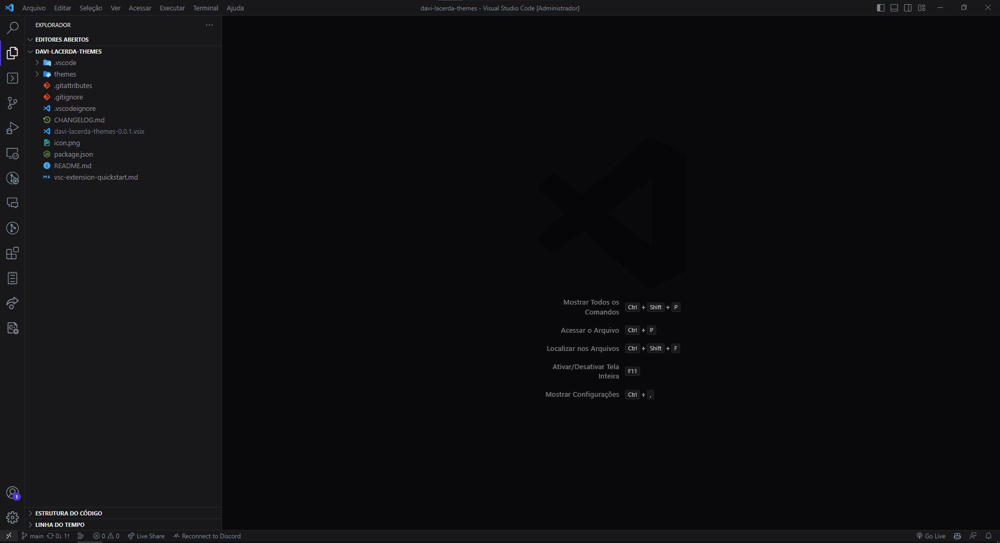

# Davi Lacerda Themes

A collection of themes designed by Davi Lacerda.

## Motivation

I'm tired of themes i have installed, so i decided to create my own themes. Personally, i like more dark themes, but considering accessibility, i decided to create a light theme too.

## Install

* In Visual Studio Code, select View -> Command Palette or press Ctrl+Shift+P;
* Then enter Install Extension;
* Write davi-lacerda-themes;
* Select it or press Enter to install.

## Selecting the theme

* In Visual Studio Code, select View -> Command Palette or press Ctrl+Shift+P;
* Then enter Preferences: Color Theme;
* Select it or press Enter to open the list of themes;
* Select Davi Lacerda | Dark or Davi Lacerda | Light.

## License

This project is licensed under the MIT License - see the [LICENSE](LICENSE) file for details.